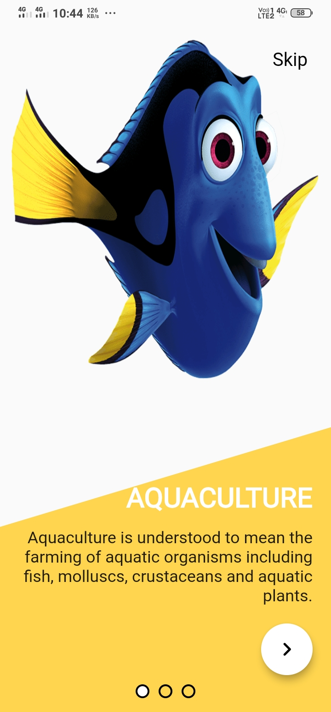
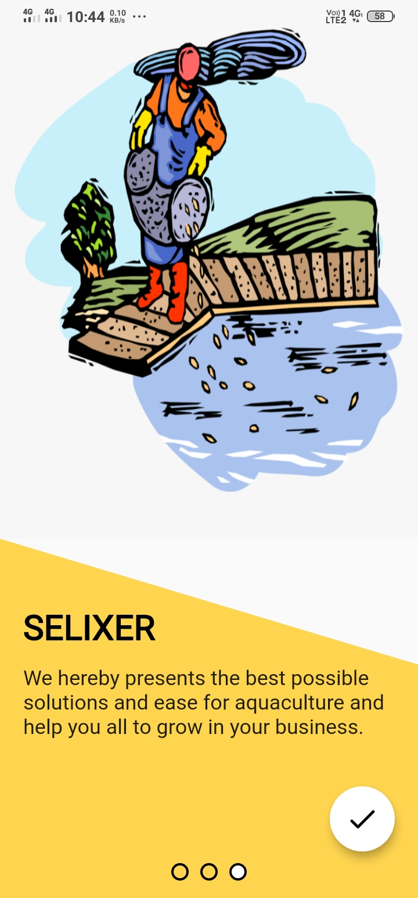
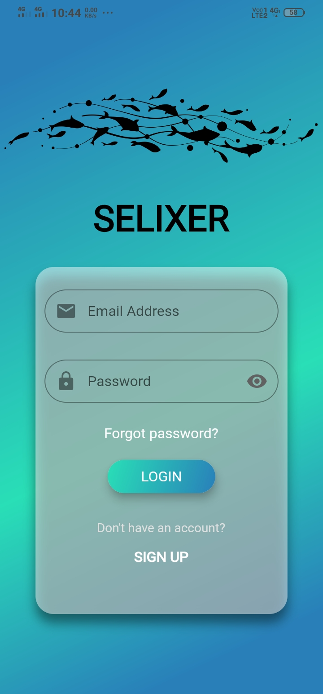
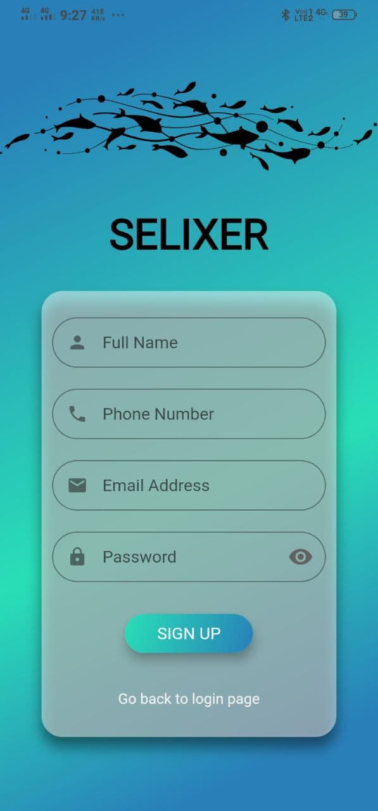
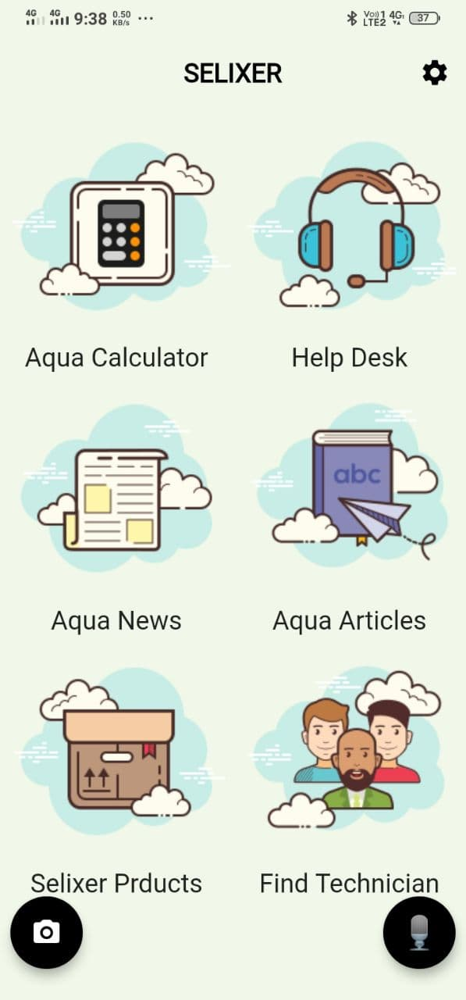
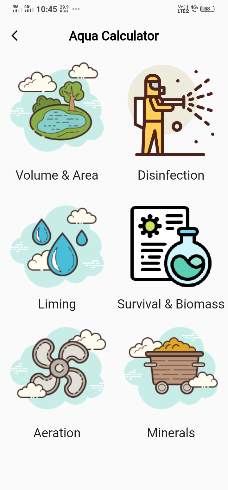
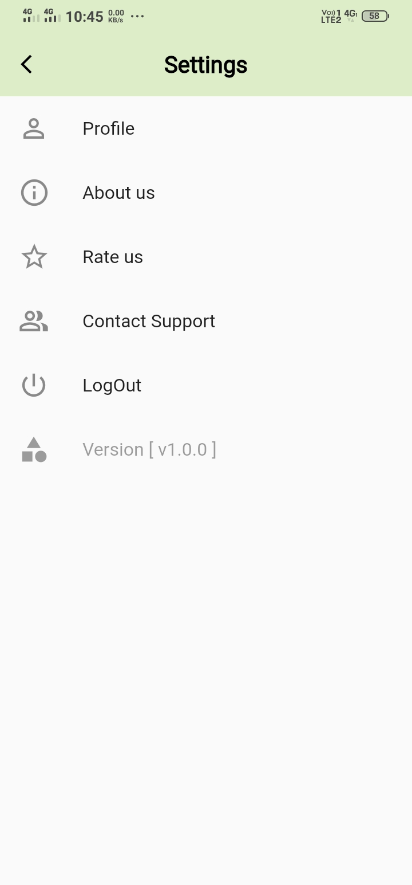
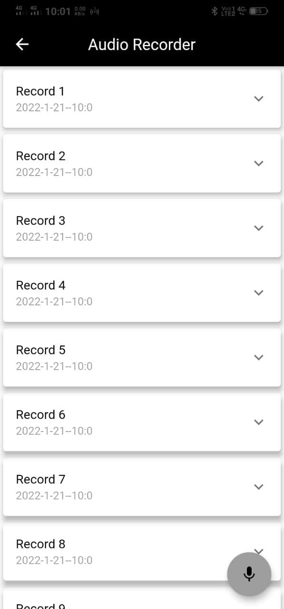
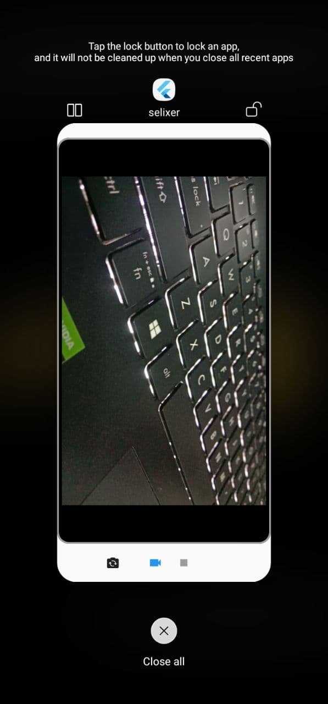

# SELIXER

An Aquaculture based project.

## Getting Started

This project is all about Aquaculture and its applications to help farmers to scale their businesses in terms of production and good quality.

- `OnBoarding Screen`

                                                  

- `Authentication`

                                                 

### Here we provide features like:

- Aqua Calculator 
- Aqua News
- Aqua Articles
- Help Desk
- Selixer Products
- Technical Support

   
                                               
#### We also provide features to interact via `Audio/Video` where consumer will record the message and send it to our technical support. 

                                                    
